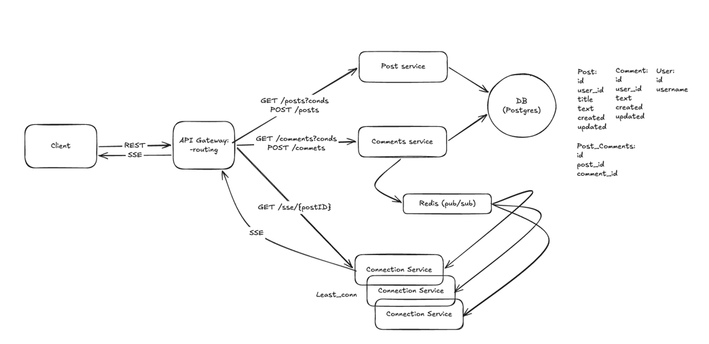

# Post and comments

Realtime comments for posts: REST for posts/comments, Server-Sent Events (SSE) for
realtime delivery, fronted by an nginx gateway.

## Architecture



- **Client (Full AI generated)** — browser.
- **API Gateway (nginx)** — single entry point / routing.
- **Post service** — Post CRUD.
- **Comment service** — Comments CRUD and
  publishes it to Redis (pub/sub).
- **Connection service** — keeps SSE connections, subscribes to Redis, pushes new comments to
  clients in realtime.

A new comment path: `POST /api/comments` → store in PostgreSQL → publish to Redis
→ every `connection_service` subscribed to that post pushes it over SSE.

## Functional Requirements

- A user can create a comment on a post
- A user receives new comments in realtime

## Non-Functional Requirements

- Low latency for receiving a comment: **p95 = 300 ms**
- Realtime delivery
- **100k concurrent connections** (2 instances more than enough)
- **1k write rps** (real traffic ~ 1k / 60 ≈ 17 rps)

## Entities

- **Post**
- **Comment**
- **User**

## API

All routes are exposed through the nginx gateway under `/api`.

> **Auth:** JWT is **planned, not yet implemented**. The `POST /api/comments`
> request will later require an `Authorization: Bearer <JWT>` header, and `user_id`
> will be derived from the token instead of the request body.

### `GET /api/posts`

List posts. Query: `limit` (default 20), `offset` (default 0).

### `GET /api/posts/{id}`

Get a post by id.

### `POST /api/posts`

Create a post.

**Body:**
```json
{ "title": "...", "text": "...", "user_id": 1 }
```

### `GET /api/comments`

List comments for a post. Query: `post_id`, `time_from` (unix seconds, `0` = all),
`limit` (default 50).

### `POST /api/comments`

Create a comment. *(JWT planned — see Auth note above.)*

**Body:**
```json
{ "post_id": 123, "text": "comment text", "user_id": 1 }
```

### `GET /api/sse/{post_id}`

Open an SSE stream (`text/event-stream`) of new comments for a post.
Each event: `data: <comment-json>\n\n`.

## Run

```bash
1) cp .env_example .env   # change if needed
2) make db_init  (setup DB)
3) make reup  (run compose)

App ready!

4) http://localhost (enter index page)
5) http://localhost/posts/2 (enter any post)
6) make load_comment (run load test)
```

## Test result 

1) make load_comment && make load_post - works ok without fails
2) make stress_comment - shows that service keeps **p95=300ms** serving around 4k rps


## Project Structure

```
cmd/
  post_service/         Entrypoint
  comment_service/      Entrypoint
  connection_service/   Entrypoint

services/
  models/               Shared domain models (Post, Comment, User)

  post_service/         Post CRUD over Postgres
    app/                Bootstrap & wiring 
    config/             Service / Postgres config
    delivery/http/      HTTP layer: router + handlers 
    service/            Business logic + repository port interface
    repository/         Postgres adapter 

  comment_service/      Comment CRUD + publishes new comments to Redis
    app/                Bootstrap & wiring
    config/             Service / Postgres / Redis config
    delivery/http/      HTTP layer: router + handlers
    service/comment/    Business logic; ports for repo + Redis publisher
      test/             Unit tests with generated mockery mocks
    repository/pg_repo/ Postgres adapter 
    clients/redis_client/  Redis PUBLISH client

  connection_service/   Holds SSE connections, fans out comments in realtime
    app/                Bootstrap; PSUBSCRIBE post:* → broadcast loop
    config/             Service / Redis config
    delivery/http/      SSE handler + router
    service/connection/ In-memory subscriber registry 
    clients/redis_client/  Redis PSUBSCRIBE client

pkg/                    Shared infrastructure 
  http_tools/           HTTP server, CORS, request decode, response/error helpers
  logg/                 Structured logger
  errors/               Typed errors

migrations/             SQL schema + setup/clear helpers
nginx/                  API gateway config 
frontend/               Vue SPA
docker-compose.yaml     Postgres, Redis, services, frontend
```